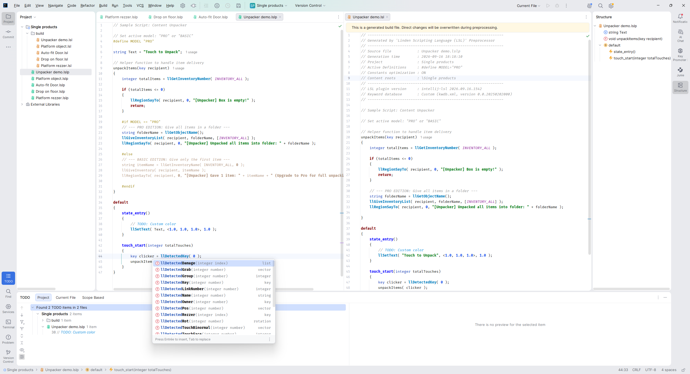
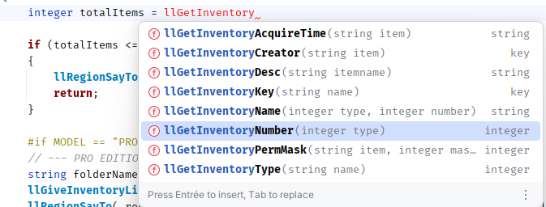
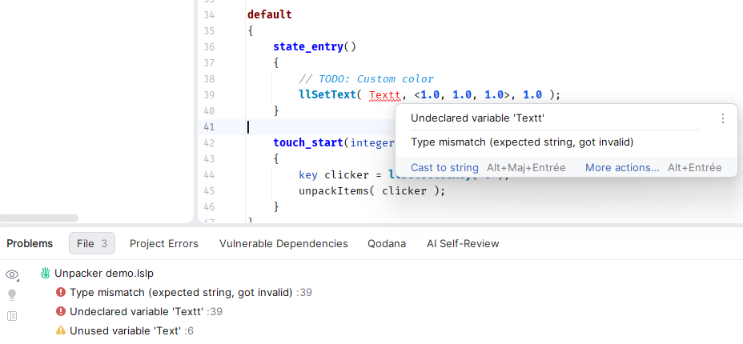
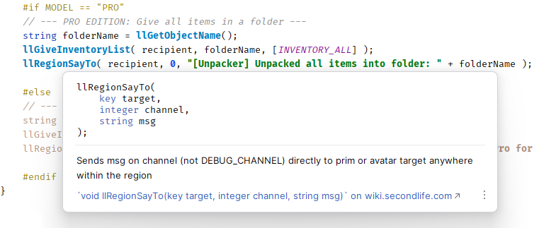
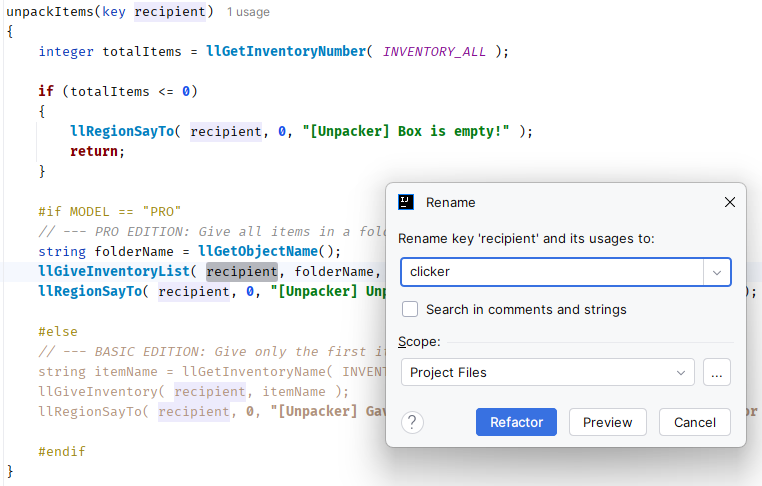

Write Linden Scripting Language (LSL) directly inside IntelliJ IDEA, PyCharm, Android Studio, and other JetBrains
editors across Windows, macOS, and Linux.

### Key Features

* **Project & File Organization:** Manage large multi-file projects using structured project views, shared library, local history, file comparison, GitHub integration, and more.
* **Advanced Preprocessor:** Use file inclusions (`#include`), function inlining (`#inline`), and conditional blocks
  (`#ifdef`...) to organize large script projects.
* **Memory Optimization:** Built-in constant optimization evaluates static math, replaces fixed variables, and eliminates dead code before compiling — keeping your script's memory footprint as small as possible in Second Life.
* **LSL Database:** Use the popular [kwdb.xml](https://github.com/Sei-Lisa/kwdb) from Sei-Lisa for the definition of
  functions, constants, and events. When new LSL functions are released, you can download or edit the XML file yourself
  without waiting for a plugin update!
* **Code Formatting & Clean Up:** Automatically format your code, fix indentation, and keep your scripts clean and readable.
* **Smart Scripting Tools:** Instant syntax highlighting, real-time error checking, smart auto-completion, and safe variable/function refactoring.

---
### How to Install

1. Open your JetBrains IDE such as [IntelliJ IDEA](https://www.jetbrains.com/idea/), PyCharm, Android Studio, or any
   other compatible IDE.
2. Choose your preferred installation method:
    * **Marketplace (Direct):**
    * 
    * **Manual ZIP:**  
      Go to **Settings** → **Plugins** , click the **⚙️ icon** at top → **Install Plugin from Disk...** to use a
      downloaded
      `intellij-lsl.zip` from [GitHub Releases](https://github.com/KoolLSL/intellij-lsl/releases).

### How to Use

1. **Create a Project:** Open your IDE, go to **File → New → Project...** and create an empty project, or use **File →
   New → Project from existing sources...**.
2. **Add Source File:** **File → New → LSL Source Script...**: Create your main script here (e.g., `MyScript.lslp`).
3. **Build:** Save your `.lslp` file (`Ctrl+S`). The plugin automatically generates an optimized, read-only **`.lsl`**
   script in the `/build` folder (e.g., `/build/MyScript.lsl`).
    * *Tip:* Right-click the `.lslp` editor tab and select **Open Generated .lsl** to quickly view the generated output
      in a new tab.
4. **Import into Second Life:** If you use the **Firestorm Viewer**, enable its LSL preprocessor to link directly to the
   generated `.lsl` file on your local disk when compiling in-world (e.g., using
   `#include "MyProject/build/MyScript.lsl"`). Alternatively, copy and paste the generated `.lsl` contents into your
   in-world script editor.

   *Tip: Type **LSL** in your IDE **Settings** to quickly access and customize plugin options.*

---

### Modules (Optional)

You can split your codebase into reusable files or use preprocessor directives as your project grows.

* **Module Files (`.lslm`):** Create shared files to store functions or constants with **File → New → LSL Module
  Script...** (e.g., `MyLib.lslm`).
* **Including Modules:** Import your created `.lslm` files into any `.lslp` script using standard preprocessor syntax:
  (e.g., `#include "MyLib.lslm"`). *(External folders must be added as Content Roots in Project Structure).*
### Directives

* **`#define`** — Defines a constant or macro (e.g., `#define MODEL "PRO"`).
* **`#undef`** — Removes an existing definition (e.g., `#undef DEBUG`).
* **`#if`** — Evaluates a custom boolean expression (e.g., ``#if MODEL == "PRO"``).
* **`#ifdef`** — Includes code if an identifier is defined (e.g., `#ifdef DEBUG`).
* **`#ifndef`** — Includes code if an identifier is *not* defined (e.g., `#ifndef DEBUG`).
* **`#elif`** — Alternative conditional branch (`else if`) within a block.
* **`#else`** — Fallback branch when prior conditions fail.
* **`#endif`** — Closes an active conditional block.
* **`#include`** — Merges an external `.lslm` module (e.g., `#include "Vectors.lslm"`). The file must be in the same
  folder or in a folder of the Project properties / Content roots.
* **`#inline`** — Inlines the function written below directly in the code instead of calling it.
---

### Auto-completion

### Inspections & Errors

### Quick Documentation Popup

### Smart Refactor

---

### Building the plugin

1. **Open Project:** Open the repository root folder in IntelliJ IDEA (2026.2.1+).
2. **Test / Install:** In the Gradle tool window, run `Tasks -> intellij -> runIde` to launch a sandbox IDE, or
   `installPluginToIDE` to test directly in your main editor.
3. **Package:** Run `Tasks -> build -> buildPlugin` to generate the distribution `.zip` in `build/distributions/`.

---
### Issues & Feedback

> This plugin is a personal side project and may not be 100% perfect. If you run into obvious issues, please report them
> on [GitHub Issues](https://github.com/KoolLSL/intellij-lsl/issues).

This project is a modernized fork of the original [riej/lsl](https://github.com/riej/lsl) plugin. Compiled and tested on
**IntelliJ IDEA 2026.2.1**, **Java 17**, and **Windows 11**.

Compared to Eclipse/LSLForge, this plugin has no internal simulator but offers preprocessing and syntax checking inside
the more modern JetBrains IDEs. This also makes the plugin easier to install and maintain.

See [official LSL documentation](https://wiki.secondlife.com/wiki/LSL_Portal).

Second Life® and SL™ are registered trademarks of Linden Research, Inc. This plugin is an independent third-party tool and is not affiliated with, sponsored by, or endorsed by Linden Research, Inc.

