

Write **LSL** (Linden Scripting Language) and **SLua** (Second Life Lua) directly inside IntelliJ IDEA, PyCharm, Android Studio, and other JetBrains
editors across Windows, macOS, and Linux.

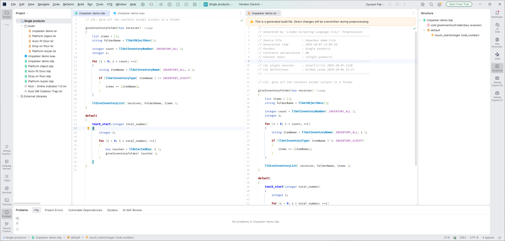

### Key Features

* **Project & File Organization:** Manage large multi-file projects using structured project views, shared library, local history, file comparison, GitHub integration, and more.
* **Up-to-date language definitions:** LSL functions, constants, and events, along with SLua definitions and documentation, are downloaded from the official [Second Life language definitions](https://github.com/secondlife/lsl-definitions) project. The plugin checks for updates or can use a custom local folder instead.
* **Smart Scripting Tools:** Instant syntax highlighting, real-time error checking, smart auto-completion, and safe variable/function refactoring.
* **Code Formatting & Clean Up:** Automatically format your code, fix indentation, and keep your scripts clean and readable.
* **Advanced Preprocessor (LSL only):** Use file inclusions (`#include`), function inlining (`#inline`), and conditional blocks (`#ifdef`...) to organize large script projects. SLua uses the `require()` module system instead.
* **Memory Optimization (LSL only):** Before compiling, built-in constant optimization evaluates static math, replaces fixed variables, and eliminates dead code to help keep scripts within LSL's memory limits. SLua has its own methods.

### Auto-completion
- **LSL**

  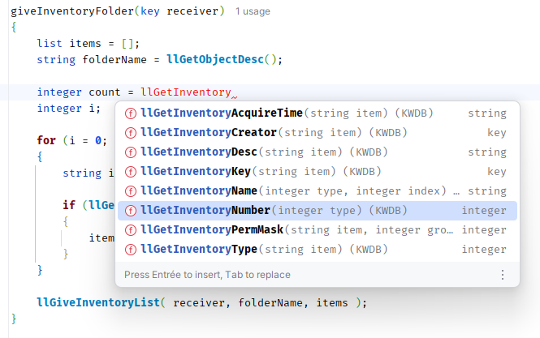

- **SLua**

  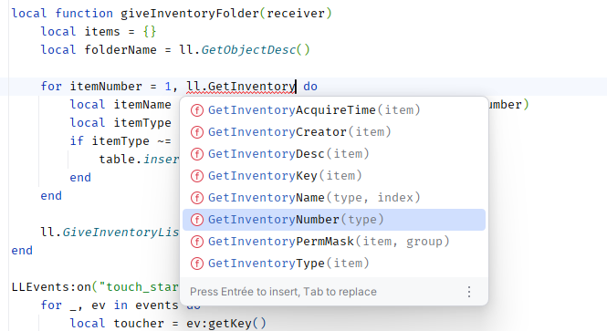

---

### Inspections & Errors
- **LSL**

  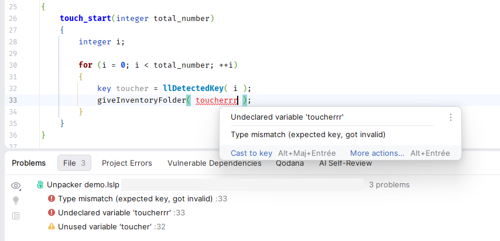

- **SLua**

  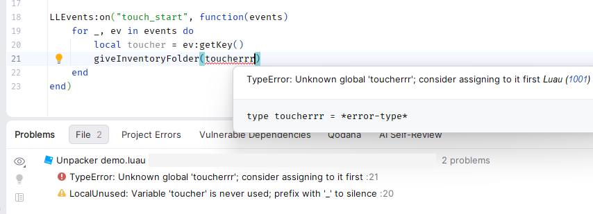

---

### Quick Documentation Popup
- **LSL**

  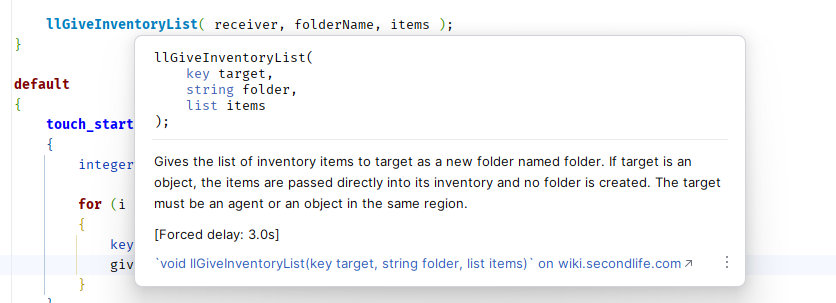

- **SLua**

  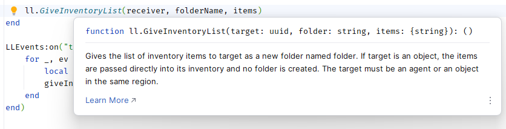

---
### Smart Refactor
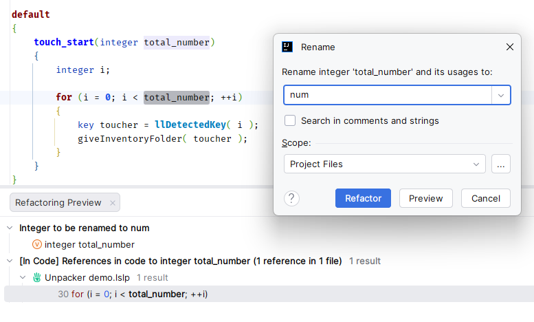

---

### IntelliJ vs VS Code

Both editors are great for Second Life scripting; the choice depends on how you like to work. VS Code with the
[official Second Life extension](https://github.com/secondlife/sl-vscode-plugin) offers a direct connection
to the Viewer and can be a lightweight fit for smaller projects. IntelliJ with this plugin may suit you better if you're working on large projects, navigating multiple scripts and library, or simply prefer a more structured IDE. It works well offline and does not depend on the SL Viewer for day-to-day scripting work. This plugin has not yet a live synchronization with the Viewer. For now, you can use Firestorm's `#include` and **Recompile** options to compile your scripts in-world. Direct Viewer integration may be added in the future if requested.

---
### How to Install

1. Open your JetBrains IDE such as [IntelliJ IDEA](https://www.jetbrains.com/idea/)..  
 
2. Install the plugin using your preferred method:
    * **Marketplace (Direct):**
    * 
    * **Manual ZIP:**  
      Go to **Settings** → **Plugins** , click the **⚙️ icon** at top → **Install Plugin from Disk...** to use a
      downloaded `intellij-lsl.zip` from [GitHub Releases](https://github.com/KoolLSL/intellij-lsl/releases).  
 
3. Complete language setup:
   * **LSL:** works out of the box with no extra setup.
   * **SLua:** the plugin checks for the companion [Luau plugin](https://plugins.jetbrains.com/plugin/24957) and offers a
     one-click install if needed. It then makes Second Life's SLua definitions available to that companion plugin. **Luau** settings should be like:
    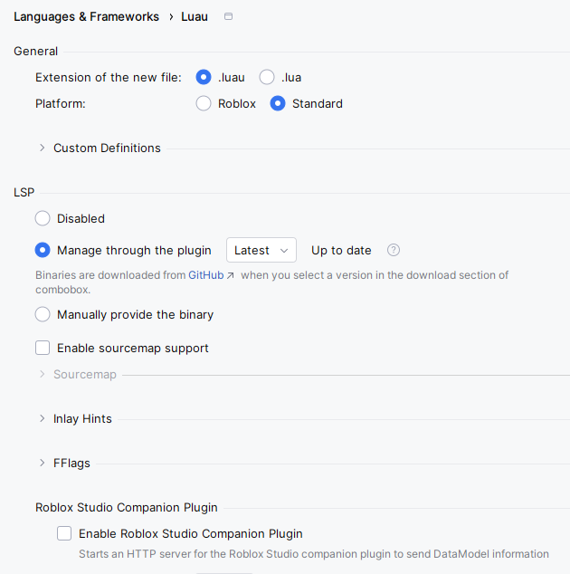 
   * The **Plugins** page should show this (LSP4IJ is needed only for IntelliJ Free edition) : 
        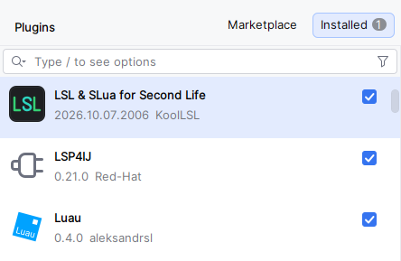
       

4. Copy <code>--definitions</code> and <code>--docs</code> full paths from the <b>LSL</b> page. They indicates where the definitions were dowloaded from GitHub:
    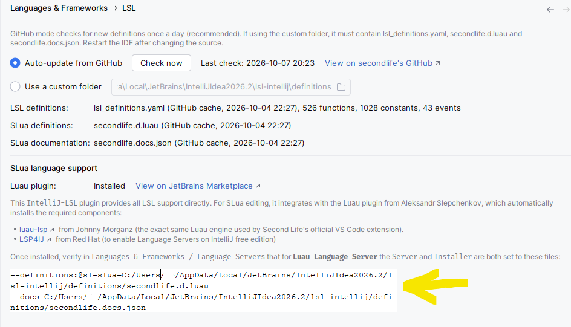
     

5. Paste in <b>Languages &amp; Frameworks &gt; Language Servers</b> &gt;
    <b>Luau Language Server</b>, for both <b>Server</b> and <b>Installer</b>, the same
 <code>--definitions</code> (including the <code>:@sl-slua</code> token) and <code>--docs</code> paths indicated on the <b>LSL</b> page: 
   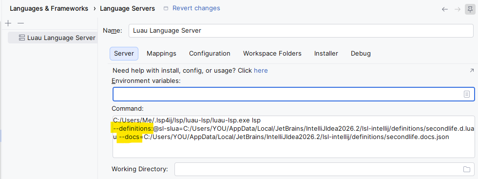
   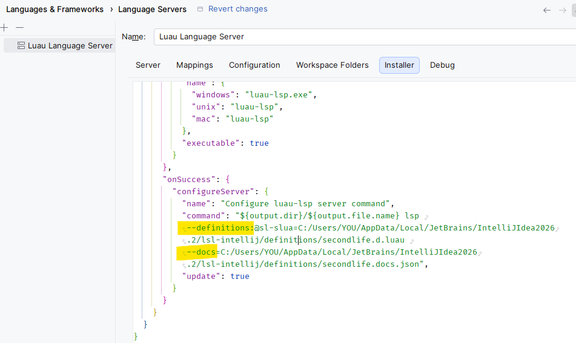
     

6. Type **LSL** in your IDE **Settings** to customize other plugin options: Code Style, Color Scheme, Inspections, Inlay Hints...  

### How to Use

1. **Create a Project:** Open your IDE, go to **File → New → Project...** and create an empty project, or use **File →
   New → Project from existing sources...**.
2. **Choose your language:**
   * **LSL:** Select **File → New → LSL Source Script...** to create a `.lslp` source file (for example,
     `MyScript.lslp`). Save it (`Ctrl+S`) to build it; the plugin generates an optimized, read-only `.lsl` file in the
     `/build` folder (for example, `/build/MyScript.lsl`). Right-click the `.lslp` editor tab and select
     **Open Generated .lsl** to view the output.
   * **SLua:** Select **File → New → Luau File** to create a `.luau` script. There is no separate build step: the `.luau` file is the script you use.
3. **Use your script in Second Life:** Firestorm users can enable its LSL preprocessor and include the
   `.lsl` or `.luau` file from disk (for example, `#include "MyProject/build/MyScript.lsl"`), or copy and paste its
   contents into the in-world editor.

---

### Include Files (LSL only)

For LSL, you can split your code into reusable files and include them in your scripts as your project grows.

* **Create an include file (`.lslm`):** Use **File → New → LSL Module Script...** to create a shared file for functions
  or constants (for example, `MyLib.lslm`).
* **Include it in a script:** Add `#include "MyLib.lslm"` to an `.lslp` script. *(External folders must be added as
  Content Roots in Project Structure.)*
### Directives

* **`#define`** — Defines a constant or macro (e.g., `#define MODEL "PRO"`).
* **`#undef`** — Removes an existing definition (e.g., `#undef DEBUG`).
* **`#if`** — Evaluates a custom boolean expression (e.g., ``#if MODEL == "PRO"``).
* **`#ifdef`** — Includes code if an identifier is defined (e.g., `#ifdef DEBUG`).
* **`#ifndef`** — Includes code if an identifier is *not* defined (e.g., `#ifndef DEBUG`).
* **`#elif`** — Alternative conditional branch (`else if`) within a block.
* **`#else`** — Fallback branch when prior conditions fail.
* **`#endif`** — Closes an active conditional block.
* **`#include`** — Includes an external `.lslm` file (e.g., `#include "Vectors.lslm"`). The file must be in the same
  folder or in a folder of the Project properties / Content roots.
* **`#inline`** — Inlines the function written below directly in the code instead of calling it.
---

### Building the plugin (optional)

This project is open source, ready to use out of the box, and you do not need to build it for normal usage. The plugin is already available via the
JetBrains Marketplace and GitHub Releases, so building it locally is mainly for contributors who want to modify the source, or test a custom build.

1. **Open Project:** Open the repository root folder in IntelliJ IDEA (2026.2.1+).
2. **Test / Install:** In the Gradle tool window, run `Tasks -> intellij -> runIde` to launch a sandbox IDE, or
   `installPluginToIDE` to test directly in your main editor.
3. **Package:** Run `Tasks -> build -> buildPlugin` to generate the distribution `.zip` in `build/distributions/`.

---
### Issues & Feedback

> This plugin is a personal side project and may not be 100% perfect. If you run into obvious issues, please report them
> on [GitHub Issues](https://github.com/KoolLSL/intellij-lsl/issues).

This project is a modernized fork of the original [riej/lsl](https://github.com/riej/lsl) plugin. Compiled and tested on
**IntelliJ IDEA 2026.2.1**, **Java 17**, and **Windows 11**.

Compared to Eclipse/LSLForge, this plugin has no internal simulator but offers preprocessing and syntax checking inside
the more modern JetBrains IDEs. This also makes the plugin easier to install and maintain.

Second Life® and SL™ are registered trademarks of Linden Research, Inc. This plugin is an independent third-party tool and is not affiliated with, sponsored by, or endorsed by Linden Research, Inc.

